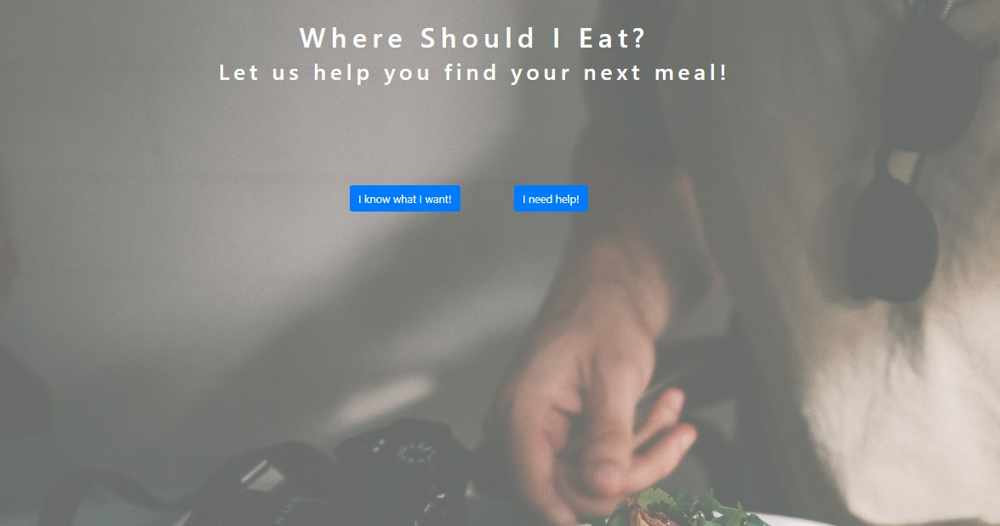
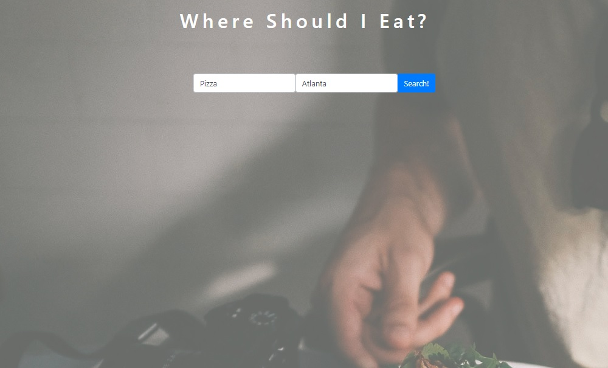
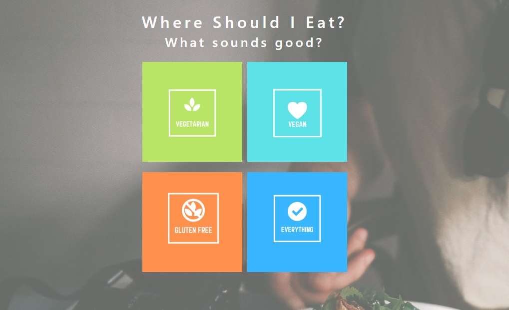
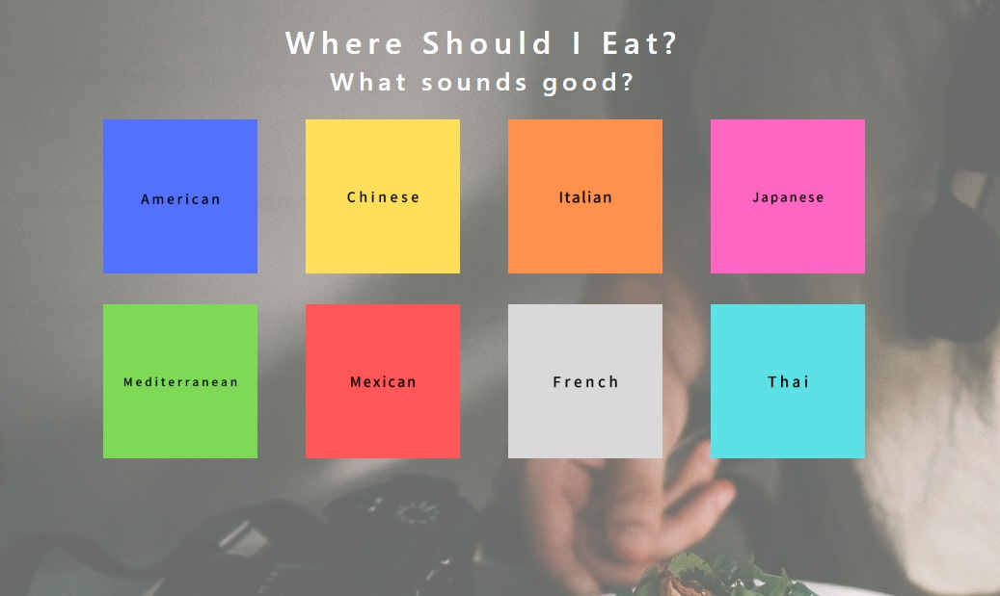
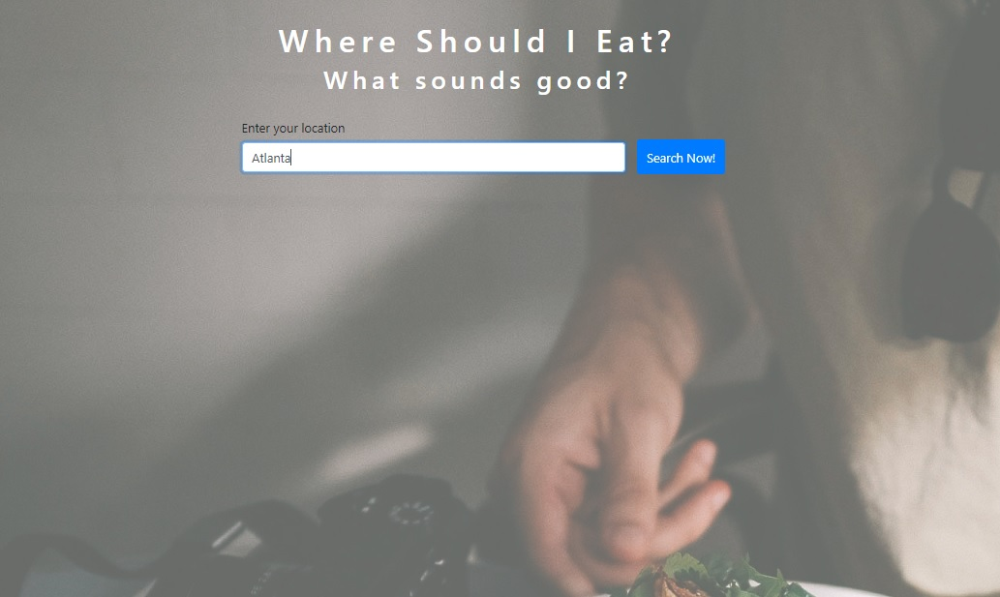
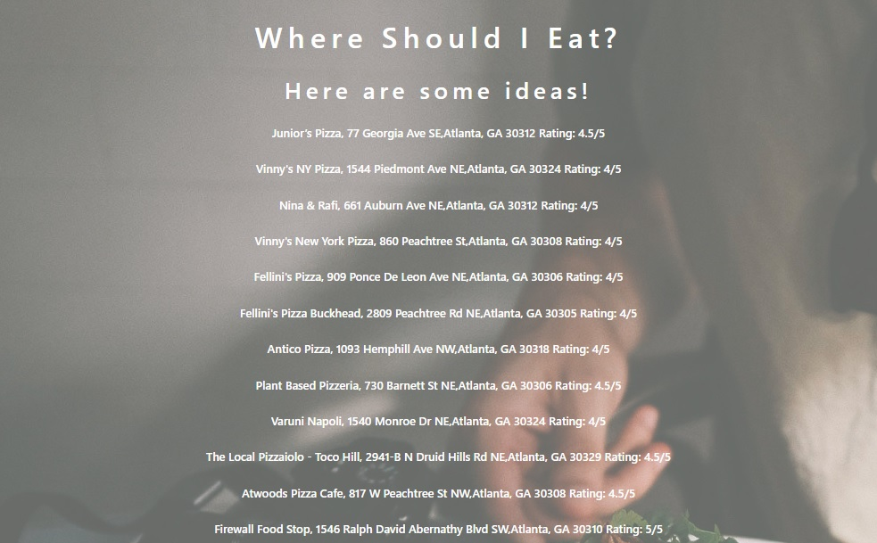
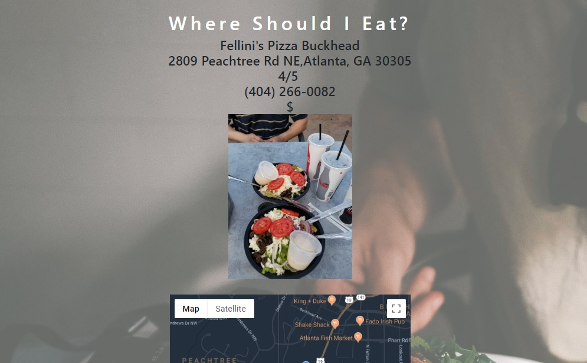
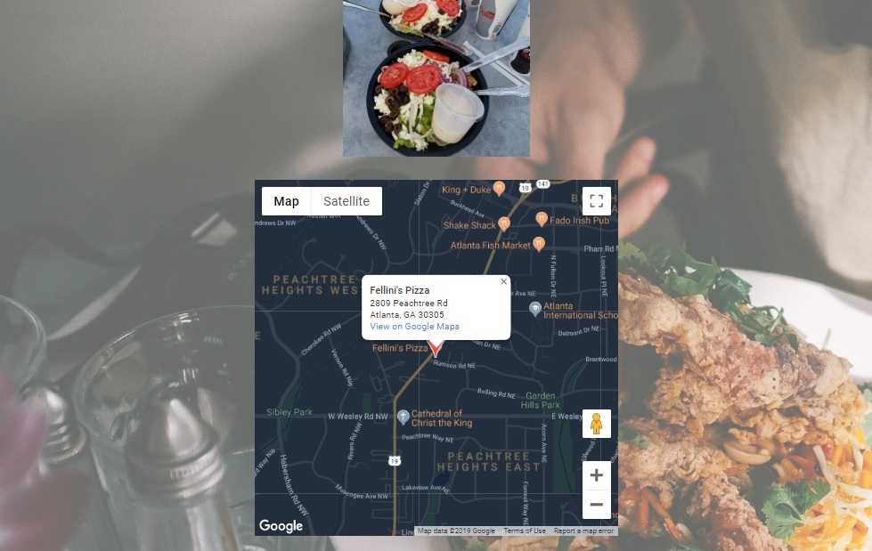

# Where Should I Eat?

Developers:
Ben Cason - Javascript Lead
Kiha Moore - Front End Lead
Tracy Collins - Front End Support
Johnny Ross - Javascript Support

This app allows users to search for nearby restaurants using Yelp API and Google Maps API. The user may search directly using a keyword and location or they may use our 'quiz' of suggestions to help them find new results.

View the deployed project [here](https://bcason9.github.io/project1/)!

## Technologies

This app utilizes Bootstrap and jQuery alongside Yelp API and Google Maps API.

## Visuals

Home Page:

Search Page for Direct Search:

Quiz panels and Location for Quiz Option:

Results from Yelp API:

Final Result page with Yelp API info and Google Maps API:

## Future Development

This project is currently front-end only. In the future Node.js and database support may be implemented in order to give the user more options. In the short term, style changes for mobile UX are being updated frequently in order to enrich the experience for the user.

